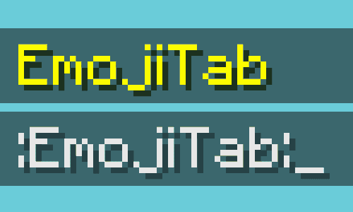
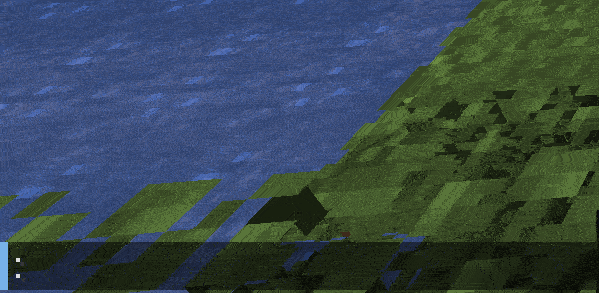
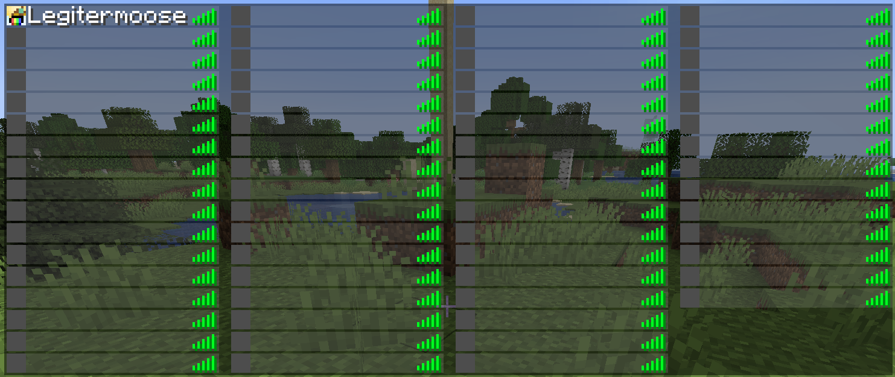
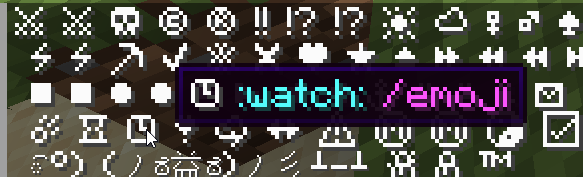

# EmojiTab


A Paper plugin for tab completion of emojis 👍

Here's a demo of the plugin in action:<br>


## Table of Contents
- [Background](#background)
  - [How does it work?](#how-does-it-work)
- [Installation](#installation)
- [Usage](#usage)
  - [Commands](#commands)
  - [Config](#config)
- [Contributing](#contributing)

## Background
Larger Minecraft servers that employ resource packs have been using these tab-completable emojis for ages. Origin Realms, Mineclub, and some upcoming servers come to mind. However, no plugin to replicate this was available to the public. Thus, EmojiTab was born.

### How does it work?
EmojiTab creates a fake "player" in the player list for each emoji shortcode. This adds them to the list of usernames you can tab-complete in any chat message.

The players all appear to have no name, and have a gray skin to blend in with the player list's background (this can be [configured](#config).) This is how the big networks do it too, but you might not notice it because the player lists are usually quite full.

To keep these fake players from appearing above _real_ players they are added to a fake scoreboard team called ``zzzzzzzzz_emoji_tab``.



#### Compatibility
EmojiTab should be compatible with all other chat/player list plugins. This is because everything is sent via packets, so none of the players/teams exist on the server. You'll notice that if you run ``/team list``, the team for sorting does not show up. On the backend, this means even if a player is looking at a custom plugin scoreboard, the team's sorting will still be in effect. If you run into any compatibility issues with other plugins, let me know!

## Installation
- Download the [latest release of EmojiTab.](https://github.com/Remynfv/EmojiTab/releases/)
- Download [ProtocolLib](https://ci.dmulloy2.net/job/ProtocolLib/)
- Place the .jar files in the plugins folder of your [Paper](https://papermc.io/) server running **1.19.2** or above.

Note: Spigot and Bukkit are **NOT** supported. This plugin uses several of Paper's API features. Paper is the [most popular](https://bstats.org/global/bukkit#serverSoftware) server software, but if there is enough demand for a Spigot version I could consider adding Spigot support.

### Dependencies
This plugin depends on [ProtocolLib](https://ci.dmulloy2.net/job/ProtocolLib/) for creating packets.

## Usage

### Commands

``/emoji reload`` - Reloads the configs and player lists.

``/emoji toggle [player]`` - Toggles _tab completion_ of emojis for player, or yourself if no player is specified. This does NOT toggle the ability to use emojis in chat.

``/emoji list`` - List all emojis in chat. Hover over them to see names, and click to enter it in chat.

``/emoji`` - Shortcut for ``/emoji list``



### Config
EmojiTab has two config files. ``config.yml`` is for plugin-wide configuration settings. ``emojis.yml`` is where you define your own emojis.

#### config.yml
```yaml
# EmojiTab by Legitimoose

# Character to put around emojis, can be left blank if desired.
# Defaults to semicolon ":"
emoji-wrapping: ":"

# Require permission emoji.use to be able to use emojis.
use-permissions: false

# Require permission emoji.use.<emoji name> to be able to use emojis.
# All emojis will still be visible in tab-completion to players without permission.
individual-permissions: false

# Whether to spam the server log with every emoji's data on startup
verbose: false

# CUSTOM PLAYER LIST SKIN
#
# Go to https://mineskin.org and choose a skin.
# Copy and paste "Texture Data" and "Texture Signature" into here.
custom-texture-data:
custom-texture-signature:
```

#### emojis.yml
By default, ``emojis.yml`` is populated with [many of the characters](https://minecraft.fandom.com/wiki/Resource_Pack#Emoji) included in [Minecraft's default font](https://minecraft.fandom.com/wiki/Resource_Pack#Default_textures).

An emoji can be one character ``⚔`` or multiple ``(ノಠ益ಠ)ノ彡┻━┻``. Custom characters can be added using a resource pack with a custom font.

``name`` is what you type in chat to make the emoji appear. ``aliases`` is any number of alternate names for the same emoji.

NOTE: The combined length of ``name`` and ``emoji-wrapping`` (found in config.yml) cannot exceed 16 characters. This is a hard limit in Minecraft, and any emoji shortcodes longer than 16 characters will be truncated (you'll get a warning in the console, too.)
```yaml
emojis:
  ⚔:
    name: swords
    aliases: crossed_swords
  ☠:
    name: skull
  ©:
    name: copyright
  ®:
    name: registered
  ™:
    name: tm
    aliases: trademark
  ‼:
    name: '!!'
  ⁉:
    name: interrobang
    aliases: [ '!?' ]
  ☀:
    name: sun
  ☁:
    name: cloud
  ♀:
    name: female_sign
  ♂:
    name: male_sign
  ♠:
    name: spades
  ♣:
    name: clubs
  ♥:
    name: hearts
  ♦:
    name: diamonds
  ⚡:
    name: lightning
    aliases: zap
  ⛏:
    name: pickaxe
  ✔:
    name: check_mark
  ❄:
    name: snowflake
  ❌:
    name: x
  ❤:
    name: heart
  ⭐:
    name: star
  ⏏:
    name: eject
  ⏩:
    name: fast_forward
  ⏪:
    name: fast_reverse
    aliases: rewind
  ⏭:
    name: next_track
  ⏮:
    name: last_track
  ⏯:
    name: play_or_pause
  ⏸:
    name: pause
  ⏹:
    name: stop
    aliases: square
  ⏺:
    name: record
    aliases: circle
  ▶:
    name: play
    aliases: arrow_forward
  ◀:
    name: reverse
    aliases: arrow_backward
  ⚓:
    name: anchor
  ☺:
    name: smile
  ☹:
    name: frown
    aliases: sad
  ✉:
    name: envelope
    aliases: email
  ☂:
    name: umbrella
  ☔:
    name: umbrella_rain
  ☄:
    name: comet
  ⛄:
    name: snowman2
  ☃:
    name: snowman
  ⌛:
    name: hourglass
  ⌚:
    name: watch
  ❣:
    name: heart_exclamation
  ⛈:
    name: lightning_rain
  ↔:
    name: left_right
  ⚠:
    name: warning
  Ⓜ:
    name: circled_M
    aliases: m
  ☯:
    name: yin_yang
  ☑:
    name: check_box
  (ノಠ益ಠ)ノ彡┻━┻:
    name: table_flip
```

## Contributing
PRs welcome! The source code is pretty well documented. If you have any questions, you can usually find me in my [Discord server](https://discord.gg/6d6RBxAkMx).
